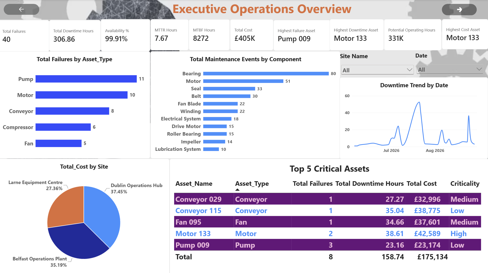
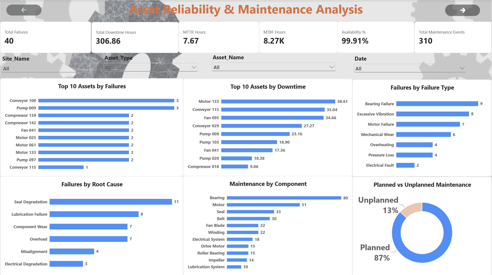
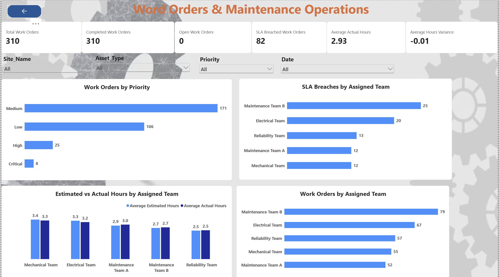
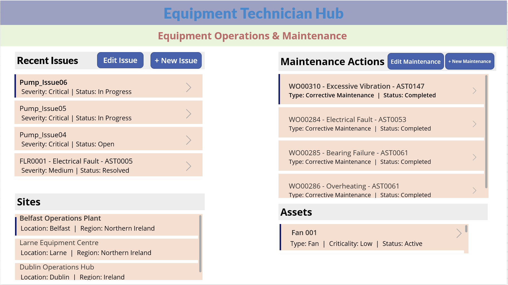

# Intelligent Equipment Operations Hub

An enterprise **Industrial Operations Intelligence platform** built with **Microsoft Fabric, Power BI, Dataverse, Power Apps, and Power Automate** to monitor equipment performance, manage operational issues and maintenance, automate workflows, and support data-driven operational decision-making.


Industrial operations generate large volumes of equipment, failure, maintenance, work-order, sensor, and cost data. When this information exists across disconnected systems, operations teams can struggle to identify equipment risks, prioritize maintenance, track failures, and respond quickly to operational issues.

The **Intelligent Equipment Operations Hub** brings these capabilities into one integrated Microsoft ecosystem.

The platform currently provides:

- Microsoft Fabric data engineering
- Bronze → Silver → Gold medallion architecture
- Fabric Lakehouse and Warehouse
- Automated data pipelines
- Power BI operational analytics
- Dataverse operational data model
- Canvas and Model-Driven Power Apps
- Maintenance and issue-management workflows
- Power Automate notifications and approvals
- Automated overdue maintenance monitoring

The next stage extends the platform with an **AI / Agentic Operations Assistant**.

---

# Business Problem

Manufacturing operations require reliable equipment and fast responses to operational issues.

Common challenges include:

- Limited visibility into asset health
- Reactive maintenance
- Repeated equipment failures
- Unplanned downtime
- Fragmented maintenance information
- Difficulty prioritizing work
- Manual issue management
- Manual notifications and approvals
- Limited operational cost visibility

This project addresses these challenges by connecting **data, analytics, operational applications, and workflow automation** into one platform.

---

# Solution Architecture

```text
Operational Data
      │
      ▼
Microsoft Fabric
      │
      ├── Bronze
      ├── Silver
      └── Gold
      │
      ▼
Fabric Warehouse
      │
      ▼
Power BI
Operational Intelligence
      │
      ▼
Microsoft Dataverse
      │
      ├───────────────┐
      ▼               ▼
Power Apps       Power Automate
      │               │
      └───────┬───────┘
              ▼
   Operational Workflow
              │
              ▼
     AI / Agentic Layer
         [Next Phase]
```

---

# Technology Stack

| Area                 | Technologies                    |
| -------------------- | ------------------------------- |
| Data Processing      | Python, Pandas                  |
| Data Platform        | Microsoft Fabric                |
| Storage              | Fabric Lakehouse                |
| Architecture         | Bronze / Silver / Gold          |
| Data Warehouse       | Fabric Warehouse                |
| Data Pipelines       | Fabric Data Pipeline            |
| Querying             | SQL                             |
| Analytics            | Power BI                        |
| Semantic Modelling   | Star Schema, DAX                |
| Operational Database | Microsoft Dataverse             |
| Applications         | Power Apps                      |
| Automation           | Power Automate                  |
| AI                   | Agentic AI / Copilot — Planned |
| Version Control      | Git, GitHub                     |

---

# Project Phases

| Phase   | Implementation                        | Status       |
| ------- | ------------------------------------- | ------------ |
| Phase 1 | Business Problem & Project Definition | ✅ Completed |
| Phase 2 | Data Setup & Quality                  | ✅ Completed |
| Phase 3 | Microsoft Fabric Data Foundation      | ✅ Completed |
| Phase 4 | Power BI Analytics & Reporting        | ✅ Completed |
| Phase 5 | Dataverse Operational Model           | ✅ Completed |
| Phase 6 | Canvas & Model-Driven Power Apps      | ✅ Completed |
| Phase 7 | Power Automate Workflows & Approvals  | ✅ Completed |
| Phase 8 | AI / Agentic Operations Assistant     | ⏳ Next      |

---

# Phase 1 — Business Problem & Project Definition

Established the business and technical foundation of the solution.

### Key Work

- Defined business problem and objectives
- Identified operational stakeholders
- Created AS-IS and TO-BE processes
- Defined business questions
- Designed KPI framework
- Defined project scope
- Created functional requirements
- Defined acceptance criteria

### Outcome

A structured operational intelligence use case with clear business objectives and implementation requirements.

---

# Phase 2 — Data Setup & Quality

Built the data-quality foundation before loading operational data into Microsoft Fabric.

Validation included:

- Primary and foreign-key integrity
- Asset-to-site relationships
- Failure and maintenance relationships
- Work-order relationships
- Valid criticality and asset status
- Load percentage validation
- Health score validation
- Negative duration and cost checks
- Date-sequence validation
- Cost reconciliation

### Outcome

A clean and relationally consistent equipment dataset ready for analytics and data engineering.

---

# Phase 3 — Microsoft Fabric Data Foundation

Implemented the core enterprise data platform using **Microsoft Fabric**.

## Medallion Architecture

```text
Raw Data
   │
   ▼
Bronze
   │
   ▼
Silver
Cleaned + Validated
   │
   ▼
Gold
Analytics Ready
```

The Fabric Lakehouse contains operational datasets covering:

- Sites
- Assets
- Sensors
- Failures
- Maintenance
- Work Orders
- Costs

Gold-layer tables were loaded into:

```text
EquipmentOperations_Warehouse
```

using **Fabric Data Pipelines**.

The analytical model contains dimensions and facts such as:

```text
dim_site
dim_asset
dim_date

fact_sensor_readings
fact_failure
fact_maintenance
fact_work_order
fact_cost
```

SQL validation was performed after warehouse loading to verify row counts, duplicates, relationships, and data consistency.

### Outcome

A reusable enterprise data foundation supporting reporting, applications, automation, and future AI workloads.

---

# Phase 4 — Power BI Analytics & Reporting

Built an interactive **Equipment Operations Intelligence Dashboard** on top of the Fabric Warehouse.

## Dashboard Areas

### Executive Overview

Provides management-level visibility into:

- Asset performance
- Equipment health
- Failures
- Downtime
- Maintenance
- Work orders
- Operational costs



### Asset Health & Reliability

Analyses:

- Health Score
- Asset Status
- Criticality
- Asset Type
- Site
- Reliability indicators



### Failure & Downtime Analysis

Provides visibility into:

- Failure frequency
- Downtime hours
- Failure severity
- Failure components
- Root causes
- Production impact



### Work Orders & Maintenance Operations

Tracks:

- Work-order priorities
- Work-order status
- Maintenance activity
- Planned vs unplanned maintenance
- Asset and site workload

Power BI slicers enable analysis by site, asset, asset type, priority, severity, maintenance type, and date.

### Outcome

Operational data was transformed into an interactive decision-support layer for managers and maintenance teams.

---

# Phase 5 — Dataverse Operational Model

Phase 5 moved the project beyond analytics by creating an operational application data layer in **Microsoft Dataverse**.

Four core Dataverse tables were implemented:

```text
Site
Asset
Issue
Maintenance Action
```

## Site

Stores manufacturing-site information.

Examples:

- Site ID
- Site Name
- Location
- Region
- Country
- Site Type

## Asset

Represents equipment managed across operational sites.

Includes information such as:

- Asset
- Asset Type
- Asset Status
- Criticality
- Site
- Health Score

## Issue

Supports operational issue management for equipment requiring investigation or maintenance.

## Maintenance Action

Tracks actions performed against operational issues.

Information includes:

- Action
- Issue
- Action Type
- Assigned technician
- Scheduled date
- Completed date
- Status
- Estimated cost
- Actual cost

Views and forms were configured to support the application layer.

### Outcome

Dataverse became the transactional operational layer connecting equipment data with Power Apps and Power Automate.

---

# Phase 6 — Canvas & Model-Driven Power Apps

Built operational applications on top of the Dataverse model.

## Model-Driven App

Configured operational views and forms for:

- Assets
- Issues
- Maintenance Actions

This provides structured access to Dataverse records for operations and administrative users.

---

## Canvas App

A technician-focused Canvas application was created for day-to-day maintenance operations.

Core application flow:

```text
Technician Home
      │
      ├── View Assets
      │
      ├── View Issues
      │
      ├── View Maintenance
      │
      ├── New Maintenance
      │
      └── Edit Maintenance
```

Functionality includes:

- Site browsing
- Asset browsing
- Issue viewing
- Maintenance-action creation
- Maintenance-action editing
- Status management
- Form validation
- Success notifications
- Screen navigation
- Data refresh
- Latest maintenance actions

Maintenance galleries automatically refresh after new actions are submitted so technicians can immediately see newly created records.



### Outcome

The project evolved from a reporting platform into an interactive operational system used to manage real maintenance activities.

---

# Phase 7 — Power Automate Workflows & Approvals

Power Automate was introduced to automate operational processes around Dataverse.

The workflows connect:

```text
Dataverse
    │
    ▼
Power Automate
    │
    ├── Notifications
    ├── Approval Processing
    ├── Maintenance Monitoring
    └── Reminder Automation
```

## Automated Operational Workflows

Flows were created to respond to Dataverse events and automate communication around operational activities.

This reduces dependency on manual monitoring of the application.

---

## Approval Workflow

An approval process was implemented for operational records requiring review.

The workflow allows business processes to move through controlled approval stages rather than relying on manual email coordination.

---

## Maintenance Notifications

Automated notifications provide users with information when maintenance-related events occur.

This connects the technician application directly with operational communication workflows.

---

## Overdue Maintenance Monitoring

A scheduled Power Automate flow was created to identify maintenance actions where:

```text
Scheduled Date < Current Date
```

and the maintenance activity has not yet been completed.

When an overdue action is detected, the workflow automatically sends a reminder notification.

The workflow was tested end-to-end by creating an overdue maintenance record and confirming that the reminder email was successfully generated.

### Outcome

Operational maintenance management is no longer dependent only on users manually checking the application.

The platform can now actively detect workflow conditions and trigger the appropriate operational communication.

---

# End-to-End Operational Flow

With Phases 1–7 completed, the platform now supports:

```text
Equipment Data
      ↓
Data Validation
      ↓
Microsoft Fabric
      ↓
Lakehouse
      ↓
Fabric Warehouse
      ↓
Power BI Intelligence
      ↓
Dataverse
      ↓
Power Apps
      ↓
Issue / Maintenance Management
      ↓
Power Automate
      ↓
Notifications / Approvals / Reminders
```

This creates a connection between **analytics and operational action**.

---

# Current Platform Capabilities

The solution can currently:

- Consolidate industrial equipment data
- Validate data quality
- Build Bronze, Silver, and Gold data layers
- Maintain a Fabric analytical warehouse
- Automate warehouse data movement
- Analyse asset reliability
- Analyse failures and downtime
- Monitor maintenance activity
- Analyse operational costs
- Track work-order performance
- Manage Sites and Assets in Dataverse
- Create and manage Issues
- Create and update Maintenance Actions
- Provide technician-facing Power Apps
- Automate operational notifications
- Execute approval workflows
- Detect overdue maintenance
- Automatically send maintenance reminders

---

# Skills Demonstrated

### Microsoft Fabric

- Lakehouse
- Medallion architecture
- Fabric Warehouse
- Data Pipelines
- Data engineering
- SQL
- Data validation

### Power BI

- Semantic models
- Star schema
- DAX
- KPI development
- Operational dashboards
- Equipment reliability analytics
- Maintenance analytics

### Power Platform

- Microsoft Dataverse
- Canvas Apps
- Model-Driven Apps
- Power Fx
- Forms and galleries
- Dataverse integration
- Power Automate
- Scheduled cloud flows
- Automated notifications
- Approval workflows

### Data Engineering

- Python
- Pandas
- ETL / ELT
- Data-quality validation
- Dimensional modelling
- Data warehousing

---

# Next Phase — AI / Agentic Operations Assistant

The next phase will introduce an intelligent operational assistant on top of the platform.

Potential capabilities include:

```text
User Question
      ↓
AI Operations Assistant
      ↓
Power BI / Fabric / Dataverse
      ↓
Operational Context
      ↓
AI Recommendation
      ↓
Human Decision
      ↓
Power Automate / Power Apps Action
```

The objective is to enable natural-language interaction with equipment and maintenance data and support faster operational investigation.

---

# Project Vision

The project is designed to evolve traditional industrial reporting into an integrated operational intelligence platform.

```text
Monitor
   ↓
Detect
   ↓
Analyse
   ↓
Investigate
   ↓
Prioritize
   ↓
Assign
   ↓
Approve
   ↓
Maintain
   ↓
Notify
   ↓
Resolve
   ↓
Learn
```

Rather than stopping at a Power BI dashboard, the **Intelligent Equipment Operations Hub** connects:

**Data Engineering → Analytics → Applications → Automation → AI**

to transform industrial data into operational decisions and actions.

---

## Current Status

### ✅ Phases 1–7 Completed

The current end-to-end platform provides:

**Operational Data → Microsoft Fabric → Fabric Warehouse → Power BI → Dataverse → Power Apps → Power Automate**

### ⏳ Next

**Phase 8 — AI / Agentic Operations Assistant**
