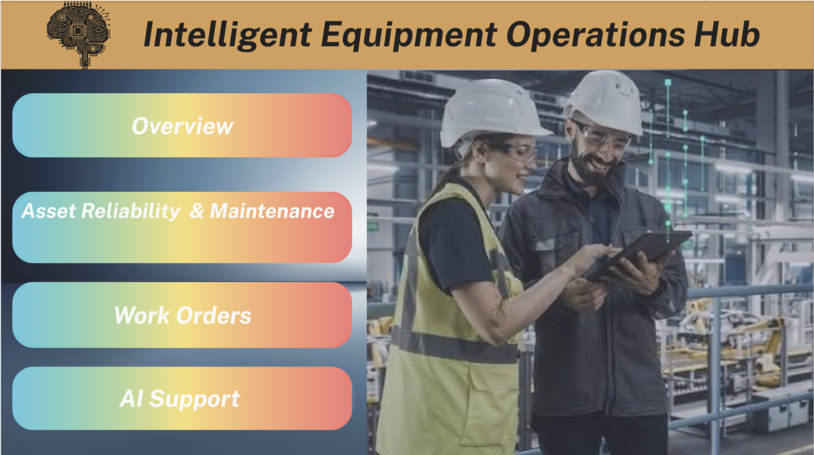

# Intelligent Equipment Operations Hub

An enterprise **Industrial Operations Intelligence platform** using **Microsoft Fabric, Power BI, Power Platform, Dataverse, and Agentic AI** to monitor equipment performance, manage operational issues, automate workflows and approvals, and deliver AI-assisted operational insights across manufacturing sites.


## Project Overview

Industrial operations generate large volumes of equipment, sensor, failure, maintenance, work-order, and cost data. However, when this information is distributed across disconnected systems, operations teams can struggle to identify equipment risks, understand downtime drivers, prioritize maintenance activity, and track operational costs.

The **Intelligent Equipment Operations Hub** is designed as a centralized industrial operations platform that transforms raw operational data into an integrated decision-support system.

The solution is being developed incrementally using the Microsoft data and Power Platform ecosystem.

The completed implementation currently covers:

- Business problem definition and operational requirements
- Equipment operations data modelling
- Data quality and validation
- Microsoft Fabric Lakehouse architecture
- Bronze, Silver, and Gold data layers
- Enterprise analytical warehouse
- Automated Fabric data pipelines
- Power BI semantic modelling
- Equipment reliability analytics
- Failure and downtime analysis
- Maintenance analysis
- Work-order operational monitoring
- Cost and operational KPI reporting

Future phases extend the platform into:

- Microsoft Dataverse operational applications
- Power Apps
- Power Automate workflows
- Approval processes
- Automated notifications
- AI-assisted operational investigation
- Agentic AI

---

# Business Problem

Manufacturing operations depend on reliable industrial equipment, but operational data often exists across multiple disconnected datasets and systems.

This creates several challenges:

- Limited visibility into overall asset health
- Difficulty identifying high-risk equipment
- Reactive rather than proactive maintenance
- Limited understanding of failure patterns
- Poor visibility into equipment downtime
- Difficulty prioritizing work orders
- Fragmented maintenance information
- Limited cost transparency
- Slow operational decision-making
- Manual reporting and issue tracking

The project addresses these challenges by creating a centralized **Equipment Operations Intelligence Hub**.

---

# Project Objectives

The platform is designed to answer key operational questions such as:

- Which assets are currently operational, degraded, or unavailable?
- Which sites contain the highest concentration of equipment risk?
- Which assets generate the most downtime?
- What failure types occur most frequently?
- Which equipment components fail repeatedly?
- What are the main root causes of equipment failures?
- How much production time is being lost because of failures?
- How much maintenance is planned versus unplanned?
- Which assets require the highest maintenance effort?
- Which work orders are currently open or overdue?
- Which work orders should be prioritized?
- How efficiently are maintenance activities being completed?
- What is the operational cost of failures and maintenance?
- Which assets should operations teams investigate first?

---

# Solution Architecture

The solution follows a layered enterprise architecture:

```text
Operational Data Sources
        │
        ▼
Microsoft Fabric Lakehouse
        │
        ├── Bronze Layer
        │   Raw operational data
        │
        ├── Silver Layer
        │   Cleaned and validated data
        │
        └── Gold Layer
            Business-ready analytical tables
                │
                ▼
        Fabric Data Pipeline
                │
                ▼
     EquipmentOperations_Warehouse
                │
                ▼
       Power BI Semantic Model
                │
                ▼
       Operational Dashboards
                │
                ▼
       Dataverse / Power Apps
                │
                ▼
       Power Automate Workflows
                │
                ▼
       AI Operational Assistant
```

---

# Technology Stack

| Layer                  | Technology                     |
| ---------------------- | ------------------------------ |
| Data Processing        | Python, Pandas                 |
| Data Platform          | Microsoft Fabric               |
| Data Storage           | Fabric Lakehouse               |
| Data Architecture      | Bronze / Silver / Gold         |
| Data Warehouse         | Fabric Warehouse               |
| Pipelines              | Microsoft Fabric Data Pipeline |
| Query Language         | SQL                            |
| Analytics              | Power BI                       |
| Data Modelling         | Star Schema                    |
| Measures               | DAX                            |
| Operational Data Layer | Microsoft Dataverse            |
| Application Layer      | Power Apps                     |
| Workflow Automation    | Power Automate                 |
| AI Layer               | Agentic AI / Copilot           |
| Development            | Jupyter / Fabric Notebooks     |
| Version Control        | Git / GitHub                   |

---

# Core Operational Data

The solution integrates multiple industrial operations datasets.

## Assets

Contains the industrial equipment master data.

Typical information includes:

- Asset ID
- Asset name
- Asset type
- Site
- Manufacturer
- Installation information
- Criticality
- Operational status
- Health score
- Load percentage

---

## Sensor Readings

Contains telemetry generated by equipment.

Sensor data can include:

- Temperature
- Pressure
- Vibration
- Power consumption
- Load percentage
- Equipment health measurements
- Timestamped operational readings

---

## Failures

Tracks equipment failure events.

Key fields include:

- Failure ID
- Asset ID
- Failure DateTime
- Failure Type
- Failure Component
- Severity
- Downtime Hours
- Detection Method
- Root Cause
- Production Impact

---

## Maintenance

Tracks equipment maintenance activities.

Includes:

- Maintenance ID
- Asset ID
- Related Failure ID
- Maintenance Type
- Maintenance Date
- Duration
- Technician information
- Planned / Unplanned maintenance
- Maintenance outcome

---

## Work Orders

Tracks operational maintenance work.

Includes:

- Work Order ID
- Asset ID
- Maintenance ID
- Failure ID
- Priority
- Status
- Created date
- Scheduled date
- Completion date
- Work duration

---

## Costs

Tracks equipment-related operational expenditure.

Includes:

- Asset ID
- Work Order ID
- Maintenance ID
- Failure ID
- Labour cost
- Parts cost
- Additional operating cost
- Total cost

---

# Data Model

The analytical layer uses a **star-schema-oriented architecture**.

## Dimensions

```text
dim_site
dim_asset
dim_date
```

## Fact Tables

```text
fact_sensor_readings
fact_failure
fact_maintenance
fact_work_order
fact_cost
```

This architecture separates descriptive business entities from operational events, improving:

- Query performance
- Model scalability
- DAX simplicity
- Dashboard usability
- Data governance
- Analytical consistency

---

# Project Development Phases

---

# Phase 1 — Business Problem & Project Definition

**Status: Completed**

The first phase established the business context and analytical foundation for the platform.

### Completed Work

- Defined the industrial equipment operations problem
- Established project objectives
- Identified operational stakeholders
- Documented the AS-IS operational process
- Designed the TO-BE process
- Defined major business questions
- Created KPI definitions
- Defined project scope
- Defined out-of-scope functionality
- Created business and technical requirements
- Defined acceptance criteria
- Completed Phase 1 validation gate

### Main Outcome

A clearly defined operational intelligence use case with measurable business objectives and technical requirements.

---

# Phase 2 — Data Setup & Quality

**Status: Completed**

Phase 2 established reliable operational datasets and implemented validation controls before loading data into the analytical platform.

### Data Quality Checks

The following checks were implemented.

### Foreign Key Validation

Validated relationships including:

```text
assets.Site_ID
sensor_readings.Asset_ID
failures.Asset_ID
maintenance.Asset_ID
work_orders.Asset_ID
costs.Asset_ID
```

Optional relationships were also validated:

```text
maintenance.Failure_ID
work_orders.Maintenance_ID
work_orders.Failure_ID
costs.WorkOrder_ID
costs.Maintenance_ID
costs.Failure_ID
```

### Business Rule Validation

Checks included:

- Valid equipment criticality
- Valid asset status
- Valid load percentage
- Valid health score
- Non-negative downtime
- Non-negative maintenance duration
- Non-negative work-order hours
- Non-negative cost values

### Date Validation

Operational chronology checks were implemented, including:

- Work order scheduled before creation
- Work order completion before creation
- Maintenance occurring before related failure

### Cost Validation

Cost calculations were reconciled to identify mismatches between component costs and total operational cost.

### Main Outcome

A validated and relationally consistent operational dataset ready for enterprise data engineering.

---

# Phase 3 — Microsoft Fabric Data Foundation

**Status: Completed**

Phase 3 migrated the operational data into **Microsoft Fabric** and established the project's enterprise analytical architecture.

---

## Medallion Architecture

A standard **Bronze → Silver → Gold** architecture was implemented.

### Bronze Layer

Stores raw operational datasets with minimal transformation.

Purpose:

- Preserve source data
- Maintain traceability
- Enable reprocessing

---

### Silver Layer

Contains cleaned and standardized operational data.

Processing includes:

- Data type standardization
- Null handling
- Schema validation
- Relationship validation
- Business-rule validation
- Duplicate handling
- Data-quality controls

---

### Gold Layer

Contains analytics-ready business tables optimized for downstream reporting.

Examples include:

```text
GOLD_DIM_SITE
GOLD_DIM_ASSET
GOLD_FACT_SENSOR
GOLD_FACT_FAILURE
GOLD_FACT_MAINTENANCE
GOLD_FACT_WORK_ORDER
GOLD_FACT_COST
```

---

# Fabric Warehouse

An enterprise warehouse was created:

```text
EquipmentOperations_Warehouse
```

Gold-layer datasets were loaded into the warehouse through Microsoft Fabric pipelines.

Example warehouse tables:

```text
dim_site
dim_asset
dim_date
fact_sensor_readings
fact_failure
fact_maintenance
fact_work_order
fact_cost
```

---

# Fabric Data Pipeline

Fabric Data Pipelines were configured to move Gold-layer data into the analytical warehouse.

Example pipeline activity:

```text
Copy_Gold_Dim_Site
```

Equivalent copy activities were created for the remaining analytical tables.

The pipeline architecture provides a repeatable mechanism for refreshing warehouse data when upstream operational information changes.

---

# Data Validation

Post-load SQL checks were performed to verify:

- Row counts
- Duplicate records
- Primary keys
- Fact-to-dimension relationships
- Warehouse consistency

Duplicate records discovered during pipeline development were investigated and corrected to ensure accurate warehouse loading.

### Main Outcome

A scalable Microsoft Fabric data foundation capable of supporting downstream analytics, operational applications, workflow automation, and AI.

---

# Phase 4 — Power BI Analytics & Reporting

**Status: Completed**

Phase 4 transformed the Fabric warehouse into an interactive **Equipment Operations Intelligence Dashboard**.

A Power BI semantic model was built on top of the analytical warehouse.

---

# Power BI Dashboard Structure

The reporting solution contains multiple operational views.



Navigation controls allow users to move between analytical pages from the main dashboard.

---

# Executive Overview

Provides senior operations stakeholders with a consolidated view of overall equipment performance.

Typical KPIs include:


The page provides a high-level operational snapshot across manufacturing sites.

---

# Asset Health & Reliability

Designed to identify equipment requiring operational attention.

Analysis includes:


The dashboard helps users identify potentially high-risk equipment and compare operational performance across sites.

---

# Failure & Downtime Analysis

Provides detailed insight into equipment failures.

Analysis includes:


This enables operations teams to identify recurring reliability problems and major downtime drivers.

---

# Maintenance Analysis

Provides visibility into maintenance activity and operational workload.

Analysis includes:

- Maintenance events
- Maintenance duration
- Maintenance type
- Maintenance status
- Asset
- Site
- Planned maintenance
- Unplanned maintenance

A dedicated **Planned vs Unplanned Maintenance** visual highlights the balance between proactive and reactive maintenance activity.

This analysis supports maintenance planning and reliability improvement.

---

# Work Orders & Maintenance Operations

A dedicated operational page was created to monitor maintenance execution.

### KPI Area

Provides top-level work-order metrics and interactive slicers.

### Work Orders by Priority

Displays work-order distribution across operational priority levels.

This allows maintenance teams to identify the current operational workload and focus on higher-priority tasks.

### Work Order Status Analysis

Shows how work orders are distributed across lifecycle states.

Examples:

```text
Open
In Progress
Scheduled
Completed
```

### Maintenance Operations Analysis

Combines work-order and maintenance information to provide visibility into current operational activities.

---

# Interactive Filtering

Power BI slicers allow users to dynamically analyze operations by dimensions such as:

- Site
- Asset
- Asset Type
- Criticality
- Failure Severity
- Work Order Priority
- Maintenance Type
- Date

Cross-filtering enables users to move from enterprise-level KPIs to individual equipment-level investigation.

---

# Power BI Semantic Model

The semantic layer connects warehouse fact and dimension tables through defined relationships.

Conceptually:

```text
                 dim_date
                    │
                    │
dim_site ─── dim_asset
                 │
       ┌─────────┼──────────┐
       │         │          │
fact_failure  fact_maintenance
       │         │
       └── fact_work_order
                 │
              fact_cost
```

The model provides a reusable analytical foundation for the operational dashboards.

---

# Current Platform Capability

After completion of Phase 4, the system can now:

- Consolidate operational equipment data
- Validate equipment data quality
- Store data using Fabric medallion architecture
- Maintain an enterprise analytical warehouse
- Refresh warehouse tables through data pipelines
- Analyse equipment reliability
- Identify equipment failures
- Analyse operational downtime
- Monitor maintenance activity
- Compare planned and unplanned maintenance
- Track work-order priorities and status
- Analyse operational costs
- Filter performance by site, asset, and operational attributes
- Support management-level operational reporting

---

# Project Progress

| Phase   | Description                           | Status       |
| ------- | ------------------------------------- | ------------ |
| Phase 1 | Business Problem & Project Definition | ✅ Completed |
| Phase 2 | Data Setup & Quality                  | ✅ Completed |
| Phase 3 | Microsoft Fabric Data Foundation      | ✅ Completed |
| Phase 4 | Power BI Analytics & Reporting        | ✅ Completed |
| Phase 5 | Dataverse Operational Model           | ✅ Completed |
| Phase 6 | Power Apps Operational Application    | ⏳ Planned   |
| Phase 7 | Power Automate Workflows & Approvals  | ⏳ Planned   |
| Phase 8 | AI / Agentic Operations Assistant     | ⏳ Planned   |

---

# Target End-State Architecture

```text
                    ┌─────────────────────┐
                    │ Operational Sources │
                    └──────────┬──────────┘
                               │
                               ▼
                    ┌─────────────────────┐
                    │ Microsoft Fabric    │
                    │ Lakehouse           │
                    └──────────┬──────────┘
                               │
                    Bronze → Silver → Gold
                               │
                               ▼
                    ┌─────────────────────┐
                    │ Fabric Warehouse    │
                    └──────────┬──────────┘
                               │
                               ▼
                    ┌─────────────────────┐
                    │ Power BI            │
                    │ Intelligence Layer  │
                    └──────────┬──────────┘
                               │
                               ▼
                    ┌─────────────────────┐
                    │ Microsoft Dataverse │
                    └──────────┬──────────┘
                               │
                   ┌───────────┴───────────┐
                   ▼                       ▼
          ┌────────────────┐      ┌────────────────┐
          │ Power Apps     │      │ Power Automate │
          └────────┬───────┘      └────────┬───────┘
                   │                       │
                   └───────────┬───────────┘
                               ▼
                    ┌─────────────────────┐
                    │ Agentic AI / Copilot│
                    └─────────────────────┘
```

---

# Business Value

The Intelligent Equipment Operations Hub demonstrates how modern Microsoft technologies can be integrated to create an end-to-end industrial operations solution.

The platform aims to transition equipment management from:

```text
Disconnected Data
        ↓
Manual Reporting
        ↓
Reactive Investigation
```

to:

```text
Connected Operational Data
        ↓
Real-Time Analytics
        ↓
Automated Workflows
        ↓
AI-Assisted Investigation
        ↓
Faster Operational Decisions
```

---

# Skills Demonstrated

This project demonstrates practical experience across:

### Data Engineering

- Microsoft Fabric
- Lakehouse architecture
- Medallion architecture
- Data pipelines
- ETL / ELT
- Python
- Pandas
- SQL
- Data-quality validation
- Data warehousing

### Data Analytics

- Power BI
- DAX
- Semantic modelling
- Star schema
- KPI design
- Operational analytics
- Equipment reliability analysis
- Failure analysis
- Maintenance analytics

### Microsoft Power Platform

Planned / developing:

- Microsoft Dataverse
- Power Apps
- Power Automate
- Approval workflows
- Business process automation

### AI

Planned:

- Copilot integration
- AI-assisted operational investigation
- Natural-language equipment queries
- Automated operational summaries
- Agentic AI workflows

---

# Project Vision

The long-term objective is to build more than a reporting dashboard.

The goal is to create an **Intelligent Equipment Operations Hub** where industrial data, analytics, applications, automation, and AI work together.

The completed platform is intended to support a workflow where:

```text
Monitor
   ↓
Detect
   ↓
Investigate
   ↓
Prioritize
   ↓
Act
   ↓
Approve
   ↓
Resolve
   ↓
Learn
```

This transforms equipment data into an operational decision and action system.

---
